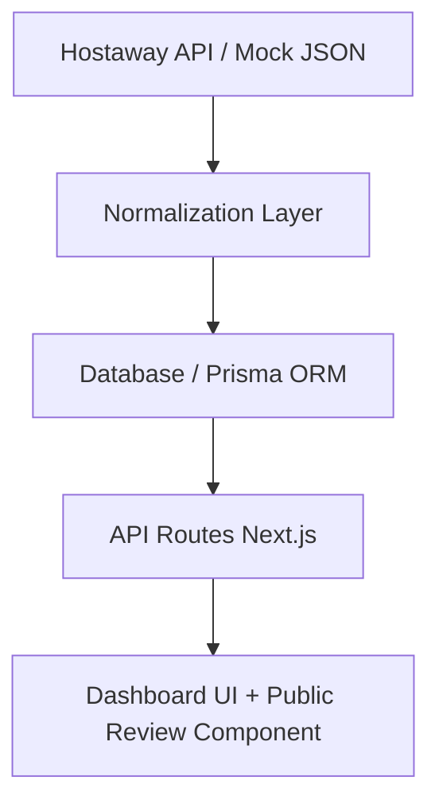

# Flex Living Reviews Dashboard – Architecture Guide <!-- id:title.v1 -->

**Goal:** Define the complete architecture for a full-stack, monolithic Next.js app implementing the Flex Living Reviews Dashboard. All sections are Claude Code–ready — each one corresponds to a coding task.

---

## 1. High-Level Overview <!-- id:overview.v1 -->

### Purpose <!-- id:overview.purpose.v1 -->

Managers can view, filter, and moderate property reviews, while public visitors see only approved reviews.

### Key Features <!-- id:overview.features.v1 -->

- **MUST** normalize raw Hostaway (and optionally Google) review data
- **MUST** provide `/api/reviews/hostaway` API route that outputs normalized JSON
- **MUST** implement Next.js dashboard UI to visualize and manage reviews
- **MUST** include public-facing component embedded in property detail page
- **MAY** include optional AI Insights panel

### Architecture Diagram <!-- id:overview.diagram.v1 -->



---

## 2. Tech Stack <!-- id:tech-stack.v1 -->

| Layer | Technology | Notes |
|-------|-------------|-------|
| Frontend | Next.js (App Router, TypeScript, TailwindCSS) | Unified front+back |
| Backend | Next.js API Routes | Simplifies infra |
| ORM / DB | Prisma + SQLite (local) or Postgres (prod) | Easy migration path |
| Deployment | Vercel or GCP Cloud Run | Simple, scalable |
| Infra-as-Code | Terraform (GCP modules) | Optional but recommended |
| AI Layer | OpenAI / Claude API | Used for insights summarization |

---

## 3. Data Flow (Next.js 15 Approach) <!-- id:data-flow.v1 -->

### When Reviews Come In <!-- id:data-flow.reviews-in.v1 -->

**From Hostaway API or mock data:**

1. Review arrives with `listingName`
2. Check if property exists: `db.property.findFirst({ where: { name: listingName } })`
3. **If property exists** → use that `propertyId`
4. **If property doesn't exist** → create it with auto-generated slug
5. Create review with `propertyId`

### Dashboard Flow (Server Components) <!-- id:data-flow.dashboard.v1 -->

```ts
// purpose: example; id: example.dashboard-flow.v1; source: architecture@1.0.0

// 1. Dashboard page.tsx is a Server Component
// 2. Directly queries Prisma:
const reviews = await db.review.findMany({ include: { property: true } })

// 3. Renders KPIs and ReviewTable with data as props
```

### Approval Flow (Server Actions) <!-- id:data-flow.approval.v1 -->

```ts
// purpose: example; id: example.approval-flow.v1; source: architecture@1.0.0

// 1. User toggles approval in ReviewTable
// 2. Calls Server Action:
approveReview(reviewId, status)

// 3. Updates database via Prisma
// 4. Calls revalidatePath('/dashboard')
```

### Public Property Page Flow (Server Components) <!-- id:data-flow.public-page.v1 -->

```ts
// purpose: example; id: example.public-page-flow.v1; source: architecture@1.0.0

// 1. User visits /property/shoreditch-heights
// 2. Queries property with approved reviews:
const property = await db.property.findUnique({
  where: { slug },
  include: { reviews: { where: { approvedForWebsite: true } } }
})

// 3. Renders property layout + reviews section
```

### API Endpoint (Required by Assessment) <!-- id:data-flow.api-endpoint.v1 -->

**MUST** implement:
- `/api/reviews/hostaway` - Fetches, normalizes, returns JSON
- For external testing by reviewers

---

## 4. Directory Structure <!-- id:directory-structure.v1 -->

```text
/app
  /dashboard
    page.tsx              # Server Component - main dashboard
    actions.ts            # Server Actions (approval toggles)
  /property/[id]
    page.tsx              # Server Component - public property page
  /api
    /reviews
      /hostaway
        route.ts          # Required API endpoint (normalization + JSON output)

/components
  /server                 # Server Components (no 'use client')
    KPISection.tsx        # Displays aggregated metrics
    PropertyReviews.tsx   # Public reviews display
  /client                 # Client Components (needs 'use client')
    ReviewTable.tsx       # Interactive table with sorting
    FiltersBar.tsx        # Filter chips and dropdowns
    ApprovalToggle.tsx    # Toggle button with optimistic updates

/lib
  db.ts                   # Prisma client singleton
  property.ts             # findOrCreateProperty helper
  normalize.ts            # Normalization logic
  insights.ts             # AI summarization (mocked)
  schemas.ts              # Zod validation schemas
  /data
    mock-hostaway-reviews.ts  # Mock API response

/prisma
  schema.prisma           # Database schema

/tests
  /api                    # API route tests
  /components             # Component tests
  /lib                    # Unit tests for normalization

/docs
  *.md                    # All documentation files

.env.example              # Template for environment variables
.env                      # Local environment (gitignored)
```

---

## 5. Data Model (Prisma) <!-- id:data-model.v1 -->

```prisma
// purpose: schema; id: schema.data-model.v1; source: architecture@1.0.0

model Property {
  id          String   @id @default(cuid())
  slug        String   @unique  // URL-friendly: "shoreditch-heights"
  name        String              // Display name: "2B N1 A - 29 Shoreditch Heights"
  description String?             // Property description
  images      Json?               // Array of image URLs
  amenities   Json?               // Array of amenities
  address     String?

  reviews     Review[]

  createdAt   DateTime @default(now())
  updatedAt   DateTime @updatedAt
}

model Review {
  id                  String    @id @default(cuid())

  // Property relation
  propertyId          String
  property            Property  @relation(fields: [propertyId], references: [id], onDelete: Cascade)

  // Review source info
  source              String    // "hostaway" or "google"
  listingName         String    // Original listing name from API (for reference)

  // Guest info
  guestName           String?
  submittedAt         DateTime

  // Ratings
  overallRating       Float?
  categories          Json      // Array of { category: string, rating: number }

  // Review content
  publicReview        String

  // Moderation
  approvedForWebsite  Boolean   @default(false)

  createdAt           DateTime  @default(now())
  updatedAt           DateTime  @updatedAt

  @@index([propertyId, approvedForWebsite])
  @@index([propertyId, submittedAt])
  @@index([listingName])
}
```

### Schema Rationale <!-- id:data-model.rationale.v1 -->

- **Property model**: Required for property detail pages showing reviews per property
- **slug field**: URL-friendly identifier (`/property/shoreditch-heights`)
- **propertyId relation**: Links reviews to specific properties
- **listingName kept**: Preserved from Hostaway API for normalization reference
- **Auto-create properties**: When review comes in, property created if doesn't exist
- **Cascade delete**: Deleting property removes its reviews
- **Indexes**: Optimized for common queries

---

## 6. Server Components & Server Actions Pattern <!-- id:server-patterns.v1 -->

**Next.js 15 uses Server Components by default.** This is a fundamental shift from client-side React.

### Server Components (Default Pattern) <!-- id:server-patterns.server-components.v1 -->

All components are Server Components unless you add `'use client'`.

**Benefits:**
- Direct database access (no API layer needed)
- Zero JavaScript sent to client
- Automatic code splitting
- Better performance and SEO

**Example: Dashboard Page**

```tsx
// purpose: example; id: example.dashboard-page.v1; source: architecture@1.0.0
// app/dashboard/page.tsx (Server Component - no 'use client')
import { db } from '@/lib/db';
import { KPISection } from '@/components/server/KPISection';
import { ReviewTable } from '@/components/client/ReviewTable';

export default async function DashboardPage() {
  // Direct database query - runs on server only
  const reviews = await db.review.findMany({
    orderBy: { submittedAt: 'desc' }
  });

  const avgRating = reviews.reduce((sum, r) => sum + (r.overallRating || 0), 0) / reviews.length;

  return (
    <main className="p-6 space-y-8">
      <KPISection reviews={reviews} avgRating={avgRating} />
      <ReviewTable reviews={reviews} />
    </main>
  );
}
```

### Server Actions (Mutations) <!-- id:server-patterns.server-actions.v1 -->

Server Actions replace API routes for mutations. Type-safe, zero-boilerplate.

**Example: Approval Toggle**

```tsx
// purpose: example; id: example.server-action.v1; source: architecture@1.0.0
// app/dashboard/actions.ts
'use server';

import { db } from '@/lib/db';
import { revalidatePath } from 'next/cache';

export async function approveReview(reviewId: string, approved: boolean) {
  await db.review.update({
    where: { id: reviewId },
    data: { approvedForWebsite: approved }
  });

  // Automatically refresh dashboard data
  revalidatePath('/dashboard');

  return { success: true };
}
```

**Using in Client Component:**

```tsx
// purpose: example; id: example.approval-toggle.v1; source: architecture@1.0.0
// components/client/ApprovalToggle.tsx
'use client';

import { approveReview } from '@/app/dashboard/actions';
import { useTransition } from 'react';

export function ApprovalToggle({ reviewId, initialState }: Props) {
  const [isPending, startTransition] = useTransition();
  const [approved, setApproved] = useState(initialState);

  const handleToggle = () => {
    setApproved(!approved); // Optimistic update
    startTransition(async () => {
      await approveReview(reviewId, !approved);
    });
  };

  return (
    <button onClick={handleToggle} disabled={isPending}>
      {approved ? '✓ Approved' : '○ Not Approved'}
    </button>
  );
}
```

### When to Use Client Components <!-- id:server-patterns.when-client.v1 -->

**MUST** add `'use client'` when you need:
- Event handlers (onClick, onChange, onSubmit)
- React hooks (useState, useEffect, useContext)
- Browser APIs (window, localStorage, document)
- Third-party libraries that use client-side features

**SHOULD** keep client components small and at leaf nodes.

---

## 7. API Contracts <!-- id:api-contracts.v1 -->

### `/api/reviews/hostaway` (GET) <!-- id:api-contracts.hostaway.v1 -->

**Purpose:** Fetch from Hostaway API (or mock), normalize, and return structured JSON.

**Status:** ✅ Implemented and tested (14/14 tests passing).

**Input (Raw Hostaway API format):**

```json
{
  "status": "success",
  "result": [
    {
      "id": 7453,
      "type": "host-to-guest",
      "status": "published",
      "rating": null,
      "publicReview": "Shane and family are wonderful! Would definitely host again :)",
      "reviewCategory": [
        { "category": "cleanliness", "rating": 10 },
        { "category": "communication", "rating": 10 },
        { "category": "respect_house_rules", "rating": 10 }
      ],
      "submittedAt": "2020-08-21 22:45:14",
      "guestName": "Shane Finkelstein",
      "listingName": "2B N1 A - 29 Shoreditch Heights"
    }
  ]
}
```

**Output (Normalized format):**

```json
// purpose: api; id: api.normalized-output.v1; source: architecture@1.0.0
[
  {
    "id": "7453",
    "source": "hostaway",
    "listingName": "2B N1 A - 29 Shoreditch Heights",
    "guestName": "Shane Finkelstein",
    "submittedAt": "2020-08-21T22:45:14Z",
    "overallRating": 10,
    "categories": [
      { "category": "cleanliness", "rating": 10 },
      { "category": "communication", "rating": 10 },
      { "category": "respect_house_rules", "rating": 10 }
    ],
    "publicReview": "Shane and family are wonderful! Would definitely host again :)",
    "approvedForWebsite": false
  }
]
```

**Implementation:**

```tsx
// purpose: api; id: api.hostaway-route.v1; source: architecture@1.0.0
// app/api/reviews/hostaway/route.ts
import { NextResponse } from 'next/server';
import { normalizeHostawayReview } from '@/lib/normalize';
import { NormalizedReviewSchema } from '@/lib/schemas';

// Mock Hostaway API response (use your provided mock data)
const MOCK_HOSTAWAY_RESPONSE = {
  status: "success",
  result: [
    // ... your mock reviews here
  ]
};

export async function GET() {
  try {
    // In real implementation, fetch from Hostaway API:
    // const response = await fetch('https://api.hostaway.com/reviews', {
    //   headers: { 'Authorization': `Bearer ${process.env.HOSTAWAY_API_KEY}` }
    // });
    // const data = await response.json();

    // For assessment, use mock data
    const rawReviews = MOCK_HOSTAWAY_RESPONSE.result;

    // Normalize each review
    const normalized = rawReviews.map(normalizeHostawayReview);

    // Validate output with Zod
    const validated = NormalizedReviewSchema.array().parse(normalized);

    // Return normalized array (no wrapper)
    return NextResponse.json(validated);
  } catch (error) {
    console.error('Normalization error:', error);
    return NextResponse.json(
      { error: 'Failed to normalize reviews', message: error.message },
      { status: 500 }
    );
  }
}
```

**Key Points:**
- **Input**: Hostaway format with `{ status, result }` wrapper
- **Output**: Flat array of normalized reviews (no wrapper)
- **Transform**: `rating: null` → calculate from `reviewCategory` average
- **Transform**: Date format `"2020-08-21 22:45:14"` → ISO 8601 `"2020-08-21T22:45:14Z"`
- **Add**: `source: "hostaway"` field
- **Add**: `approvedForWebsite: false` default

### ~~`/api/reviews/[id]/approve`~~ (DEPRECATED) <!-- id:api-contracts.deprecated.v1 -->

**Use Server Actions instead** (see Section 6).

Approval toggles are handled via Server Actions:
- `app/dashboard/actions.ts::approveReview()`
- Type-safe, automatic revalidation
- No manual API route needed

---

## 8. Core Functions & Validation <!-- id:core-functions.v1 -->

### `findOrCreateProperty(listingName: string): Promise<string>` <!-- id:core-functions.find-or-create-property.v1 -->

**MUST** implement:
- Checks if property exists by name
- If exists → returns `propertyId`
- If not → creates property with auto-generated slug, returns new `propertyId`

**Example:**

```tsx
// purpose: function; id: function.find-or-create-property.v1; source: architecture@1.0.0
// lib/property.ts
import { db } from '@/lib/db';

export async function findOrCreateProperty(listingName: string): Promise<string> {
  // Try to find existing property
  let property = await db.property.findFirst({
    where: { name: listingName }
  });

  // If doesn't exist, create it
  if (!property) {
    const slug = listingName
      .toLowerCase()
      .replace(/[^a-z0-9]+/g, '-')
      .replace(/^-|-$/g, '');

    property = await db.property.create({
      data: {
        name: listingName,
        slug,
        description: `Property in ${listingName.split('-').pop() || 'unknown location'}`,
      }
    });
  }

  return property.id;
}
```

### `normalizeHostawayReview(raw: RawHostawayReview): NormalizedReview` <!-- id:core-functions.normalize.v1 -->

**MUST** implement:
- Converts Hostaway schema → internal normalized format
- Ensures missing ratings become null, and dates are ISO
- Handles edge cases (missing guest names, null ratings, malformed dates)

**Example:**

```tsx
// purpose: function; id: function.normalize-review.v1; source: architecture@1.0.0
// lib/normalize.ts
import { NormalizedReview, RawHostawayReview } from '@/lib/schemas';

export function normalizeHostawayReview(raw: RawHostawayReview): NormalizedReview {
  // Calculate overall rating from categories if not provided
  const overallRating = raw.rating ?? calculateAverageFromCategories(raw.reviewCategory);

  return {
    id: raw.id.toString(), // Convert to string
    source: 'hostaway',
    listingName: raw.listingName,
    guestName: raw.guestName || 'Anonymous', // Fallback
    submittedAt: new Date(raw.submittedAt).toISOString(), // Convert to ISO 8601
    overallRating,
    categories: raw.reviewCategory.map(c => ({
      category: c.category,
      rating: c.rating
    })),
    publicReview: raw.publicReview,
    approvedForWebsite: false, // Default to not approved
  };
}

function calculateAverageFromCategories(categories: { category: string; rating: number }[]): number {
  if (categories.length === 0) return 0;
  const sum = categories.reduce((acc, c) => acc + c.rating, 0);
  return sum / categories.length;
}
```

### Zod Validation Schemas <!-- id:core-functions.zod-schemas.v1 -->

**MUST** use Zod for runtime type validation at API boundaries.

```tsx
// purpose: schema; id: schema.zod-schemas.v1; source: architecture@1.0.0
// lib/schemas.ts
import { z } from 'zod';

// Raw Hostaway API response (matches actual API structure)
export const RawHostawayReviewSchema = z.object({
  id: z.number(),
  type: z.string(), // "host-to-guest" or "guest-to-host"
  status: z.string(), // "published"
  rating: z.number().nullable(), // Overall rating (null if not provided)
  publicReview: z.string(),
  reviewCategory: z.array(z.object({
    category: z.string(),
    rating: z.number()
  })),
  submittedAt: z.string(), // Format: "2020-08-21 22:45:14"
  guestName: z.string().optional(),
  listingName: z.string(),
});

// Normalized internal schema (your unified format)
export const NormalizedReviewSchema = z.object({
  id: z.string(), // Convert number to string
  source: z.enum(['hostaway', 'google']),
  listingName: z.string(),
  guestName: z.string().optional(), // Fallback to "Anonymous" if missing
  submittedAt: z.string().datetime(), // Convert to ISO 8601
  overallRating: z.number().min(0).max(10).optional(), // Calculate from categories if null
  categories: z.array(z.object({
    category: z.string(),
    rating: z.number()
  })),
  publicReview: z.string(),
  approvedForWebsite: z.boolean(), // Default: false
});

export type RawHostawayReview = z.infer<typeof RawHostawayReviewSchema>;
export type NormalizedReview = z.infer<typeof NormalizedReviewSchema>;
```

### `generateAIInsights(reviews: NormalizedReview[]): AIInsights` <!-- id:core-functions.ai-insights.v1 -->

**MAY** implement:
- Groups similar complaints using keyword analysis
- Summarizes positive vs negative themes
- Outputs `topIssues`, `summaryBlurb`, and `highlightQuotes`
- **Mocked implementation** (no API key required for demo)

**Example:**

```tsx
// purpose: function; id: function.ai-insights.v1; source: architecture@1.0.0
// lib/insights.ts
export function generateAIInsights(reviews: NormalizedReview[]): AIInsights {
  // Mock implementation for demo
  return {
    topIssues: [
      { issue: 'Noise complaints', frequency: 3, sentiment: 'negative' },
      { issue: 'Excellent location', frequency: 15, sentiment: 'positive' }
    ],
    summaryBlurb: 'Overall positive with occasional noise concerns',
    highlightQuotes: reviews.slice(0, 3).map(r => r.publicReview)
  };
}
```

---

## 9. Frontend Composition <!-- id:frontend-composition.v1 -->

### Dashboard Page (`/dashboard`) <!-- id:frontend-composition.dashboard.v1 -->

**Server Component** - Direct database access

```tsx
// purpose: example; id: example.dashboard-composition.v1; source: architecture@1.0.0
// app/dashboard/page.tsx
export default async function DashboardPage({ searchParams }) {
  const reviews = await db.review.findMany({
    include: { property: true },
    orderBy: { submittedAt: 'desc' }
  });

  return (
    <main className="p-6 space-y-8">
      <KPISection reviews={reviews} />
      <FiltersBar />
      <ReviewTable reviews={reviews} />
      <AIInsightsPanel reviews={reviews} /> {/* Optional */}
    </main>
  );
}
```

**Components:**
- `KPISection` (Server Component) - Avg ratings, # reviews, trend
- `FiltersBar` (Client Component) - Rating range, category, time filters
- `ReviewTable` (Client Component) - Data grid with approval toggle
- `AIInsightsPanel` (Server Component) - Optional AI insights

### Public Property Page (`/property/[slug]`) <!-- id:frontend-composition.public-page.v1 -->

**Server Component** - Replicates Flex Living property detail layout

```tsx
// purpose: example; id: example.property-page.v1; source: architecture@1.0.0
// app/property/[slug]/page.tsx
export default async function PropertyPage({ params }) {
  const property = await db.property.findUnique({
    where: { slug: params.slug },
    include: {
      reviews: {
        where: { approvedForWebsite: true },
        orderBy: { submittedAt: 'desc' },
        take: 6 // Show 6 most recent
      }
    }
  });

  if (!property) notFound();

  return (
    <main className="max-w-7xl mx-auto px-4 lg:px-8 py-8">
      <div className="grid grid-cols-1 lg:grid-cols-[1fr_400px] gap-8">
        {/* Main Content */}
        <div className="space-y-8">
          <ImageGallery images={property.images} />
          <PropertyHeader property={property} />
          <AboutSection description={property.description} />
          <AmenitiesSection amenities={property.amenities} />

          {/* Guest Reviews Section */}
          {property.reviews.length > 0 && (
            <GuestReviewsSection reviews={property.reviews} />
          )}

          <LocationSection address={property.address} />
        </div>

        {/* Booking Sidebar (sticky) */}
        <BookingSidebar property={property} />
      </div>
    </main>
  );
}
```

**Layout Structure** (matches Flex Living design):
- Two-column layout (main content + sticky sidebar)
- Guest Reviews section between Amenities and Location
- Only shows `approvedForWebsite: true` reviews
- Styled using `design-system@1.0.0` tokens

---

## 10. Security & Config <!-- id:security.v1 -->

**MUST** handle:
- API keys via `.env` (Hostaway, Google, AI provider)
- No auth required for local demo (trusted internal)

**SHOULD** add for production:
- Wrap dashboard under NextAuth / role check
- Rate limiting on API routes
- Input validation with Zod

---

## 11. Extensibility Notes <!-- id:extensibility.v1 -->

**To add Google Reviews:**
- Implement `/api/reviews/google`
- Reuse `NormalizedReview` structure
- Merge results in dashboard UI

**To scale infra:**
- Move DB to Postgres on GCP / Neon
- Use server actions for mutations (type-safe)

---

## References <!-- id:references.v1 -->

| ref | target | purpose |
|-----|--------|---------|
| R1 | `scope@1.0.0` | Product requirements |
| R2 | `dashboard-metrics@1.0.0` | Dashboard features |
| R3 | `design-system@1.0.0` | UI styling |
| R4 | `nextjs-best-practices@1.0.0` | Implementation patterns |
| R5 | https://theflex.global | Design consistency source |
| R6 | https://nextjs.org/docs | Next.js 15 docs |
| R7 | https://react.dev | React 19 patterns |

